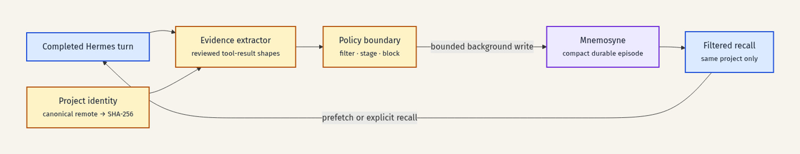

# Architecture

The bridge wraps the upstream Mnemosyne Hermes provider. It keeps the storage engine and normal read tools while adding policy at the provider boundary.

The editable Mermaid source is [`architecture.mmd`](architecture.mmd).

## Components

### Project identity

`project.py` derives a non-secret identifier from the repository remote. It removes transport credentials, normalizes the host, removes a terminal `.git`, maps equivalent SSH and HTTPS remotes to one identity, and hashes the canonical value. If no remote exists, it hashes the resolved workspace and retains only a sanitized directory basename.

### Evidence extraction

`evidence.py` reads the completed Hermes tool trajectory and recognizes a deliberately small set of deterministic result shapes. It emits no more than one compact episode. Raw prompts, assistant prose, command output, and file contents are excluded.

The outcome describes the final meaningful evidence item. A failed command is stored as a verified failure, not mislabeled as success.

### Recall filtering

`filtering.py` allows ordinary global facts through but restricts execution episodes to the active project ID. Both explicit tool recall and prefetch use the same project boundary. Parse failures return no project episodes.

### Mutation policy

`policy.py` classifies each Mnemosyne tool as read-only, direct, staged, blocked, or unknown. Unknown mutations fail closed. An ordinary memory is direct only when it has an explicit scope, `source="user"`, `veracity="stated"`, and disabled extraction. The provider verifies every direct write by reading back the exact stored record. Other ordinary write payloads return `clarification_required` so the agent asks instead of silently omitting an important ambiguity.

`pending.py` stores owner-only pending records. A record is content-addressed, expires, is bound to the originating session and project, and can be claimed only once. Stage and list results expose the exact tool, payload, and payload digest for review. The provider requires both an exact tool argument and an exact foreground user message before applying a supported mutation. Once claimed, an ID cannot be replayed, including after an application or verification failure.

### Background writer

Hermes requires `sync_turn()` to return without waiting for storage latency. The bridge does not call the upstream autosave/consolidation hook, disables its automatic-sleep flag, and overrides session-end consolidation and built-in-memory mirroring. It extracts the small episode synchronously, then puts it on a bounded queue serviced by one daemon writer. A full queue drops the episode and logs a warning rather than blocking the host turn. Shutdown does not close upstream state while the writer remains active.

## Extension points

The current evidence recognizers and mutation adapters are intentionally conservative. New tool-result validators should be explicit functions with synthetic adversarial tests. Apart from the narrowly defined direct ordinary-memory path above, new mutation families require:

1. a precise policy classification;
2. an owner-only staged representation;
3. exact foreground approval;
4. deterministic mutation acknowledgement;
5. deterministic read-back of every writable field;
6. tests for replay, session crossover, project crossover, malformed payloads, and partial failure.

## Upstream coupling

The alpha uses upstream private attributes and a small number of Mnemosyne schema details for filtering and read-back. These are isolated risks, not stable contracts. The compatibility matrix and integration tests must be updated before dependency pins move.
